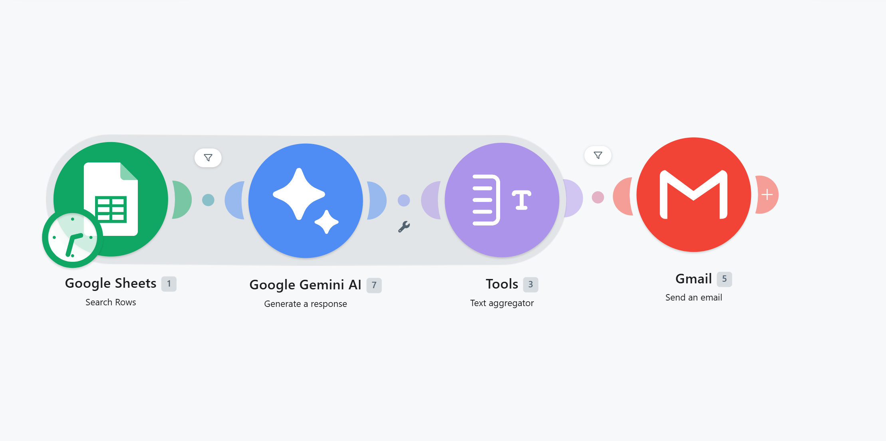
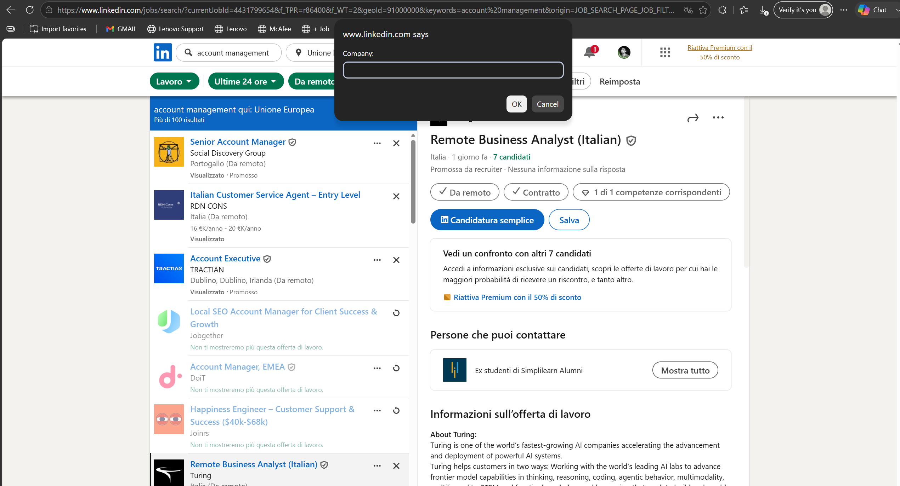
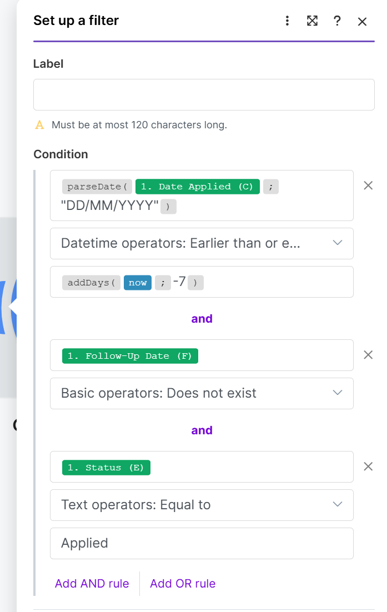
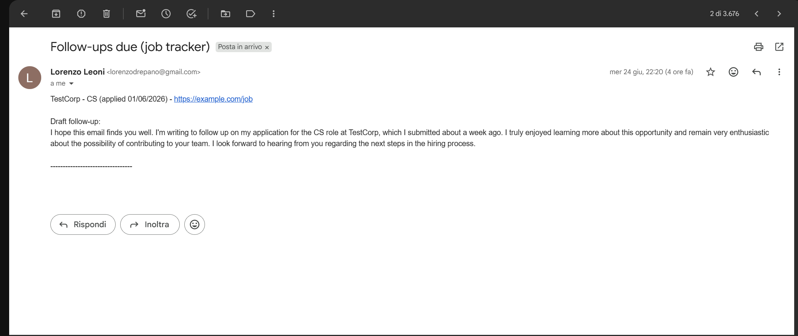

# Job Application Tracker — Automated Capture, Follow-up Reminders & AI Drafting

An end-to-end automation that captures job applications with one click, reminds me
to follow up on the ones going cold, and drafts a tailored follow-up email for each
using an LLM — built with Make.com, Google Sheets, and the Gemini API.

> **In one sentence:** I turned a spreadsheet I kept forgetting to update into a
> hands-off system that captures applications as I browse and nudges me — with a
> ready-to-send draft — when one needs a follow-up.

## The problem

Job hunting generates a stream of applications that are easy to lose track of. The
applications that slip through the cracks aren't the rejections — they're the
**silent ones**, where neither side followed up. A short, polite follow-up at the
one-week mark measurably improves response rates, but doing that manually requires
remembering which applications are a week old, on which day, every day. Nobody
sustains that.

I'd tried tracking applications in a spreadsheet before and always abandoned it,
for two reasons: adding a row meant breaking focus to switch tabs and type, and
nothing ever reminded me to follow up. So I built a system that removes both points
of friction.

---

## What I built

A three-part system:

1. **One-click capture** — a browser bookmarklet that grabs the current job
   listing's URL and title and writes a new row to my tracker, without leaving the
   page.
2. **A daily "going cold" reminder** — a scheduled automation that finds
   applications older than 7 days with no reply and no follow-up logged, and emails
   me a single digest.
3. **AI-drafted follow-ups** — each application in that digest arrives with a
   tailored follow-up email written by an LLM, ready to send.

**Stack:** Make.com (orchestration) · Google Sheets (data store) · JavaScript
(capture bookmarklet) · Google Gemini API (draft generation).

---

## How it works

## 0. The capture scenario. 

A standalone Make.com scenario with two modules: a custom webhook that receives the application data, and a Google Sheets "Add a Row" action that appends it. Trivial on its own — but isolating it behind a webhook is what lets any number of capture methods feed the same store without touching the write logic.

### 1. Capture: a bookmarklet, not "fully" manual entry

The bookmarklet auto-captures what's reliable — the page URL and today's date — and pre-fills 
the role from the page title, then prompts me to confirm the company and role before sending. 
(Job sites bury company and role names inconsistently in their HTML, so a confirm-step is more 
robust than brittle auto-extraction — and removing even that step is exactly what the planned LLM parser does.)

I deliberately put a **webhook** between the bookmarklet and the sheet rather than
writing to Sheets directly. That decoupling means the capture method and the storage
logic are independent: I can point a bookmarklet, a form, or (later) an
LLM-powered parser at the same webhook without ever rewiring the Sheets side.

**A real problem I had to solve here:** the bookmarklet failed on LinkedIn. LinkedIn
serves a strict **Content Security Policy (CSP)** that blocks scripted network calls
(`fetch`) to domains not on its allow-list — a security measure to stop injected
scripts from exfiltrating data. My webhook isn't on LinkedIn's list, so the `fetch`
was refused.

The fix: send the request as an **image load** instead of a `fetch`. CSP governs
image requests under a separate, near-always-permissive directive (`img-src`) than
scripted connections (`connect-src`). Since I only need to *send* data and don't need
to read a response, routing the request through `new Image().src` slips it through a
door the site leaves open — the same "tracking pixel" technique analytics tools have
used for years.

### 2. The daily reminder: filtering for what actually needs attention

A second Make.com scenario runs once a day on a schedule. It reads every row, then
applies a filter that keeps only the applications that genuinely need a nudge — three
conditions, all of which must be true:

- **Status is still "Applied"** — so anything that moved to Interviewing / Rejected /
  Offer drops out automatically.
- **Applied more than 7 days ago** — the "going cold" test.
- **No follow-up date recorded** — so once I log a follow-up, the application stops
  reminding me forever.

That third condition is what stops the system nagging me about follow-ups I've
already done: the **Follow-up Date** column doubles as an off-switch.

**The tricky part — date comparison.** Google Sheets stored dates as text
(`01/06/2026`), and comparing text character-by-character doesn't answer "is this
older than 7 days." Make compares *real dates*, not date-shaped text, so the date
condition uses `parseDate(value; "DD/MM/YYYY")` to convert the cell into a true date,
then tests it against `addDays(now; -7)` — the timestamp for exactly one week ago.
Getting the format string to match the stored format exactly (including a European
DD/MM/YYYY layout) was the single most common failure point while building this.

### 3. AI-drafted follow-ups

Before the matching applications are bundled into the digest email, each one passes
through a **Gemini API** call (Flash model, on the free tier) that drafts a short,
polite follow-up referencing the specific role and that it's been about a week. The
LLM step sits *before* the aggregation step on purpose — it has to run once per
application, while the rows are still flowing individually, so each draft is tailored
rather than generic.

A **text aggregator** then assembles each application and its draft into one readable
block, and the digest is emailed to me. On days when nothing is going cold, a
not-empty guard suppresses the email entirely, so quiet days stay quiet.

---

## Design decisions

- **Webhook as a decoupling layer.** Capture method and storage are independent, so
  new input sources can be added without touching the write logic.
- **The Follow-up Date column as a state switch.** Reusing an existing data field to
  control the automation's behaviour avoided adding a separate "reminded?" flag.
- **LLM call placed before aggregation.** Ensures per-application drafts instead of
  one generic message — a small ordering choice with a big quality difference.
- **Free-tier Gemini Flash over a paid model.** Drafting three sentences doesn't need
  a flagship model; Flash is free, fast, and well within rate limits for a once-daily
  job.
- **ISO / unambiguous date handling.** Date-format ambiguity caused real bugs (an
  early draft misread 01/06 as January 6th); standardising the stored format and
  telling the LLM the convention fixed it.

---

## Some questionable improvements that could be done (the first one augments automation but sacrifices control)

- **LLM-powered capture (replace manual entry):** a second capture path where I paste
  a raw job listing and an LLM extracts company, role, and link into structured JSON,
  removing manual confirmation entirely. (This reuses the exact LLM-in-Make pattern
  from the follow-up drafter, pointed at *extraction* instead of *generation*.)
- **Status auto-updates** by parsing reply emails, so the tracker reflects reality
  without manual edits.
- **A lightweight dashboard** summarising applications by status and response rate.

---

## What this project demonstrates

- Designing a multi-stage automation with a clean separation between capture,
  storage, logic, and output.
- Debugging real-world constraints: browser security policies (CSP), date parsing
  and locale ambiguity, and structured-vs-raw API responses.
- Integrating an LLM into a workflow for both content *generation* and (planned)
  data *extraction* — and knowing when a cheap model is the right call.
